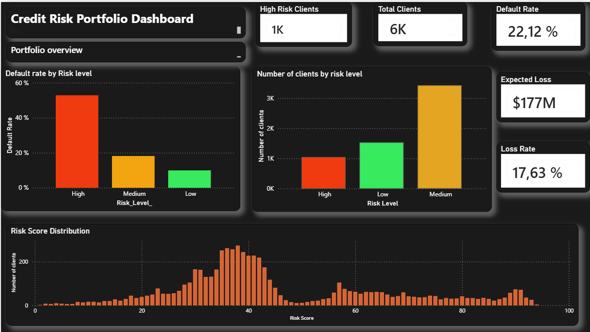
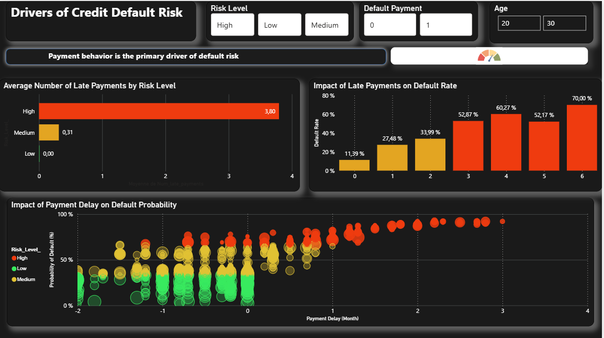

# 💳 Credit Risk Scoring & Expected Loss Modeling Dashboard

End-to-end credit risk project combining **data engineering, statistical modeling, and business-oriented analytics** to support portfolio-level decision-making.

---

## 🎯 Business Objective

Financial institutions must continuously balance **risk and profitability** by identifying high-risk clients early while maintaining portfolio performance.

This project aims to:

- Estimate **Probability of Default (PD)** at client level  
- Structure **risk segmentation for portfolio management**  
- Quantify financial exposure through **Expected Loss (EL)**  
- Provide a **decision-oriented dashboard** for risk monitoring  

---

## 🧠 Credit Risk Framework

The project follows a simplified but realistic financial risk framework:

- **PD (Probability of Default)** → estimated via machine learning  
- **LGD (Loss Given Default)** → assumed constant at 45%  
- **EAD (Exposure at Default)** → proxied by credit limit  

➡️ **Expected Loss (EL) = PD × LGD × EAD**

This enables:

- Individual risk quantification  
- Portfolio-level loss estimation  
- Risk-based prioritization  

---

## ⚙️ Methodology

### 1. Data Preparation & Feature Engineering

The dataset was transformed into **behavioral and financial risk indicators**:

- Number of late payments  
- Maximum delay  
- Average delay  
- Total billed amount  
- Total repayment amount  
- Payment-to-bill ratios  
- Credit utilization proxies  

#### Data Treatment Strategy

- Outliers handled using **percentile capping (1% / 99%)**
- Approach chosen instead of removal to **preserve financial dispersion**
- Ensures stability of model inputs in high-variance monetary data  

---

### 2. Predictive Modeling (Python)

A **Logistic Regression model with L2 regularization** was implemented to estimate PD.

#### Rationale

- Interpretability (critical for financial environments)  
- Robustness to multicollinearity  
- Direct probability output  

#### Modeling Pipeline

- Train/Test split (80/20, random_state=42)  
- Feature scaling using **StandardScaler**  
- Class imbalance handled with **SMOTE applied on training data only**  
- Evaluation using classification metrics  

#### Performance

- ROC AUC ≈ 0.75+  
- Strong separation between default / non-default classes  
- SMOTE improved recall on minority (default) class  

---

### 3. Risk Scoring & Segmentation

Model outputs were translated into a **business-oriented scoring system**:

- PD → Score (0–100)  
- Segmentation:
  - 🟢 Low Risk  
  - 🟡 Medium Risk  
  - 🔴 High Risk  

#### Business Purpose

- Simplify interpretation for non-technical stakeholders  
- Enable risk-based decision-making  
- Prioritize monitoring and intervention  

---

## 📊 Power BI Dashboard

A two-layer dashboard was developed to support **operational and analytical use cases**.

---

## 📸 Dashboard Preview

### 🔎 Portfolio Monitoring



This page provides a **portfolio-level view**:

- Risk distribution across segments  
- Default rate per segment  
- Total client population  
- Expected Loss estimation  
- Score distribution  

👉 Enables **risk monitoring and exposure assessment**

---

### 📉 Risk Drivers Analysis



This page focuses on **behavioral risk analysis**:

- Relationship between payment delays and default probability  
- Distribution of late payments across risk segments  
- Identification of key behavioral risk drivers  

👉 Enables **understanding of default mechanisms**

---

## 💡 Key Insights

- 🔴 Payment behavior (late payments, delays) is the **primary driver of default risk**  
- 📈 Default probability increases significantly with delay severity  
- ⚠️ High-risk clients generate the **highest expected loss per client**  
- 📊 Medium-risk segment represents the **largest exposure volume**  

---

## 💼 Business Impact

This project demonstrates direct application to financial risk management:

- Early identification of high-risk clients  
- Quantification of portfolio exposure via Expected Loss  
- Support for credit approval and limit decisions  
- Structured portfolio segmentation for monitoring  

---

## ⚠️ Limitations

- LGD assumed constant (no recovery modeling)  
- EAD approximated using credit limit  
- Logistic Regression does not capture non-linear interactions  
- No temporal modeling (static snapshot of risk)  

---

## 🧠 Technical Stack

- Python (Pandas, NumPy, Scikit-learn)  
- Machine Learning (Logistic Regression, SMOTE)  
- Data Visualization (Matplotlib, Seaborn)  
- Power BI (Data Modeling, DAX, Dashboarding)  


## 📂 Project Structure

```
credit-risk-scoring-model/

├── images/
│   ├── dashboard_overview.png
│   └── risk_drivers.png
│
├── credit_risk_scoring_results.csv
├── RISK_SCORING_MODEL_CT.ipynb
├── Credit_risk_score_PBI.pbix
├── README.md
```


## 🚀 Conclusion

This project replicates a **real-world credit risk workflow**, from raw data to decision support:

- Feature engineering aligned with financial behavior  
- Interpretable probability modeling  
- Risk scoring and segmentation  
- Business-oriented dashboarding  

It demonstrates the ability to **bridge data analysis and financial decision-making**.

---

## 🎯 Why This Project Matters

This project highlights advanced capabilities required in risk/data roles:

- Strong understanding of credit risk concepts  
- Ability to build interpretable models  
- Translation of data into actionable insights  
- End-to-end analytical thinking  

---

## 📬 Contact

Open to opportunities in:

- Financial Risk Quantitative Analysis  
- Credit Risk Modeling
- Risk management   
- Data Analytics (Finance / Fintech)

## 📂 Project Structure
